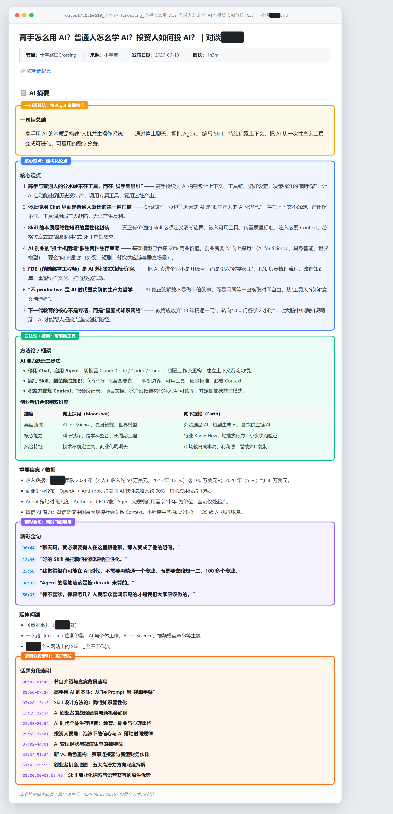

# Podcast Transcriber

**[中文](README.md) | [日本語](README_JA.md)**

Turn podcasts into a searchable, skimmable knowledge base.

## Why This Tool Exists

I subscribe to dozens of high-quality podcasts — AI research, business insights, deep tech interviews, investment frameworks. Each episode runs 1-3 hours, with a dozen new ones dropping every week. Listening to all of them is impossible, but missing them feels wasteful.

So I developed a workflow that works for me: **transcribe first, skim the summary, then selectively listen.**

1. **Batch transcribe**: Feed episode URLs to the tool — it handles downloading and speech-to-text automatically
2. **Skim & filter**: Spend 2 minutes reading a summary (key insights + quotes + topic index) to decide whether an episode deserves a full hour of your time
3. **Deep listen**: For episodes that pass the filter, use the topic index to jump straight to the most relevant segments

This is essentially a **"breadth-first, then depth" learning method** — AI compresses 1 hour of audio into 2 minutes of reading, so your attention goes only to truly high-value information. Podcasts stop being ephemeral streams you forget after listening; they become searchable, reviewable, quotable personal knowledge assets.

This tool handles the most mechanical part: **downloading audio, running speech-to-text, and producing a timestamped transcript document**. Summarization and analysis are left to you (or your AI assistant) — because understanding content is the learner's job.



> Above: a structured summary (key insights + frameworks + quotes + further reading) generated by an AI assistant from the transcript. The tool itself only produces the timestamped transcript; the summary is left to you or your AI assistant.

## Features

- **One command, end to end**: URL → metadata extraction → audio download → ASR → Markdown + PDF
- **Platform-agnostic**: JSON-LD / OpenGraph / HTML5 audio / direct audio URLs — no lock-in
- **Timestamped verbatim transcript**: Every sentence tagged with precise time for easy navigation
- **Local caching**: Audio and transcripts cached locally; re-processing the same episode skips download
- **Fully local by default**: faster-whisper (Whisper large-v3, CPU int8) recognition + FunASR ct-punc punctuation restoration, producing **sentence-level, punctuated segments** on par with Bailian Paraformer — no cloud API key required, audio never leaves your machine
- **Optional Bailian ASR**: Set `asr.backend: bailian` to switch to DashScope Paraformer for faster transcription or weaker hardware (see "Local vs Cloud: How to Choose" below)
- **YouTube support**: Pass a YouTube video URL directly; the audio stream is resolved via yt-dlp (requires `pip install yt-dlp`)
- **Proxy support**: Set `network.proxy` (or the `HTTPS_PROXY` env var) to reach restricted sites like YouTube; downloads automatically fall back to direct connection if the proxy fails

## Quick Start

### 1. Install dependencies

```bash
pip install -r requirements.txt
```

If you run on CPU, install the CPU-only PyTorch build to save space and download time:

```bash
pip install torch --index-url https://download.pytorch.org/whl/cpu
```

### 2. Machine requirements & time estimates for local transcription

The default local pipeline = **faster-whisper (Whisper large-v3, CPU int8 quantization) recognition + FunASR ct-punc punctuation restoration**, producing sentence-level punctuated segments, fully offline.

**Two models are downloaded automatically on first run** (cached afterwards):

| Model | Purpose | Size | Source |
|------|------|------|--------|
| Whisper large-v3 (CTranslate2 format) | Speech recognition | ~3.1GB | HuggingFace or ModelScope |
| ct-punc (CT-Transformer) | Punctuation restoration | ~1.05GB | ModelScope (automatic) |

**Hardware requirements (pure CPU, no GPU needed)**:

| Tier | CPU | RAM | What to expect |
|--------|-----|------|--------|
| Minimum | 4-core x86-64 (2018+) | 8GB | Works, but takes ~6-8× the audio duration |
| Recommended | 8+ cores (e.g. i5-1240P / R7-5800U / M1 or better) | 16GB | ~3-3.5× the audio duration |
| Comfortable | 12+ cores high-clock / Apple Silicon | 16GB+ | ~2-3× the audio duration |

> Peak RAM usage is ~4-5GB (~3GB recognition model + ~1.5GB punctuation model). With less than 8GB RAM, consider the cloud Bailian ASR instead.

**Time estimate formula**: `transcription time ≈ audio duration × realtime factor + ~30s model loading`.

Real-world reference (i5-1240P / 8 threads / int8): a 5-minute episode takes ~15-18 minutes; a 1-hour episode takes ~3-3.5 hours. Punctuation restoration is fast (~150 chars/sec) and negligible in the total.

> Tip: `cpu_threads` (default 8) can be tuned to your physical core count; `beam_size` defaults to 1 (Chinese quality virtually identical to beam=5, ~35% faster). See the `asr` section notes in `config/config.example.json`.

### 3. Bailian ASR (optional)

If local CPU is too slow or you want faster transcription, switch to Bailian (DashScope) Paraformer:

```bash
cp config/config.example.json config/config.json
```

Edit `config.json`:

```json
{
  "asr": {
    "backend": "bailian"
  },
  "bailian": {
    "api_key": "YOUR_BAILIAN_API_KEY",
    "model": "paraformer-v2"
  }
}
```

`api_key` can also be read from the `DASHSCOPE_API_KEY` environment variable to avoid writing it to the config file.

### Local vs Cloud: How to Choose

Both backends produce the identical output format (sentence-level segments + timestamps + Markdown/PDF), and you can switch at any time. Match the choice to your machine:

| Dimension | Local (faster-whisper + ct-punc) | Cloud (Bailian Paraformer) |
|------|----------------------------------|------------------------|
| Speed | ~2-8× audio duration (depends on CPU) | ~0.1-0.2× audio duration; a 1-hour episode in minutes |
| Cost | Free | Pay-per-use (free tier available) |
| Privacy | Audio never leaves your machine | Audio uploaded to the cloud |
| Network | Only needed for the first model download | Required throughout |
| Barrier | A CPU with 8GB+ RAM | A Bailian API key |
| Quality | large-v3 + punctuation restoration, sentence-level | Paraformer-v2, sentence-level |

**Recommendations by machine profile**:

- **16GB+ RAM and an 8+ core CPU from the last ~5 years** → local transcription. Quality on par with cloud, free and private; the wait for short episodes (<20 min) is perfectly acceptable
- **8-16GB RAM, 4-8 core CPU** → local works but is slow. Use local for short episodes; for 1-hour+ episodes prefer the cloud, or run local overnight
- **<8GB RAM / old CPU / need results immediately** → cloud Bailian ASR
- **Sensitive content that cannot be uploaded** → local (no other option); if your machine is too weak, consider running on a better one

> A hybrid setup is common: run daily short episodes locally, and batch the accumulated long ones through `backend: bailian`.

### 4. Network proxy (optional)

If your network cannot reach certain sites directly (e.g. YouTube), configure an HTTP proxy. The tool uses it for metadata fetching and audio download; if the proxy is unavailable, downloads automatically fall back to a direct connection.

Edit `config.json`:

```json
{
  "network": {
    "proxy": "http://127.0.0.1:7897"
  }
}
```

The `HTTPS_PROXY` / `HTTP_PROXY` environment variables are also honored (config file takes precedence).

### 5. Transcribe

```bash
# From a podcast webpage
python main.py https://example.com/podcast/episode-42

# Direct audio URL (provide title manually)
python main.py https://cdn.example.com/audio/ep42.mp3 --title "The Future of AI"

# YouTube video (requires yt-dlp; set network.proxy if restricted)
python main.py https://www.youtube.com/watch?v=VIDEO_ID

# Metadata only (preview, no transcription)
python main.py --dry https://example.com/podcast/episode-42
```

Output is saved to `output/` — one folder per episode, containing Markdown and PDF.

## Output Example

For a 50-minute episode:

```
# Episode Title
> Show | Source | Published | Duration
🔗 [Listen to original](url)

---

## 📝 Full Transcript (12,345 chars)

[00:00] Welcome to today's episode...
[00:15] The topic we're covering today is...
[01:02] The first key point is...
...

---
_Generated by Podcast Transcriber · For personal learning only_
```

Once you have the transcript, you can (or your AI assistant can):
- Generate a structured summary (key arguments + methodologies + quotes)
- Build a topic-segmented index (for jump-to-listen navigation)
- Extract action items or further reading
- Compare content across multiple episodes

## How It Works

```text
URL input
  │
  ├─ podfetch.py      → Web scraping: JSON-LD / OpenGraph / HTML5 audio; YouTube via yt-dlp
  ├─ podtranscribe.py → Download audio (optional proxy) → faster-whisper recognition + ct-punc punctuation restoration → sentence-level timestamped segments
  ├─ podsummarize.py  → Assemble Markdown document
  └─ md2pdf.py        → Markdown → PDF (CJK-aware)
  │
  └─ output/<date_show_title>/  ← MD + PDF
```

## Project Structure

```
├── main.py               # CLI entry point
├── podfetch.py           # Generic metadata fetching
├── podtranscribe.py      # Audio download + local faster-whisper recognition + ct-punc punctuation restoration
├── podsummarize.py       # Transcript document building + output management
├── podauth.py            # Local config loading
├── md2pdf.py             # Markdown → PDF
├── SKILL.md              # AI Agent skill description (for agent invocation)
├── config/
│   └── config.example.json
└── output/               # Transcription artifacts (gitignored)
```

## Supported Sources

Not tied to any platform. Works with any page containing:

- JSON-LD (`PodcastEpisode` / `AudioObject`)
- OpenGraph (`og:audio`)
- HTML5 `<audio>` tags
- Direct audio URLs (.mp3 / .m4a / .wav / .ogg / .aac / .flac / .opus)
- YouTube video links (audio stream resolved via yt-dlp, optional)

Verified: Xiaoyuzhou (小宇宙), Apple Podcasts, Spotify (web), TWiT, Libsyn-hosted podcasts, YouTube, and more.

## Use as an AI Agent Skill

This project includes a `SKILL.md` that can be installed directly as an agent skill. The agent uses this tool for transcription, then leverages its own model capabilities to generate summaries, topic segmentation, and further reading — no external API configuration needed.

## FAQ

**Q: How long does transcription take?**
A: Download 1-3 min; local transcription takes ~2-8× the audio duration (depending on CPU; ~3-3.5× on 8-core machines), so a 1-hour podcast takes roughly 3-4 hours. On the Bailian cloud backend it takes just minutes. See "Machine requirements & time estimates" above.

**Q: What languages are supported?**
A: Whisper large-v3 supports Chinese, English, Japanese, and many others; ct-punc punctuation restoration handles mixed Chinese-English text. For Chinese podcasts, set `"language": "zh"`.

**Q: Can I transcribe podcasts from YouTube?**
A: Yes — just pass the YouTube URL (requires `pip install yt-dlp`). If YouTube is unreachable, set a working proxy in `network.proxy` (e.g. Clash's `http://127.0.0.1:7897`).

**Q: PDF shows garbled Chinese text?**
A: A CJK font is required. Windows and macOS usually include one; on Linux install `fonts-wqy-zenhei`.

**Q: Can I batch process?**
A: Yes. A simple shell loop works:
```bash
for url in $(cat urls.txt); do python main.py "$url"; done
```

## Data Flow

1. **Metadata extraction**: Parse public HTML for title, audio URL (local)
2. **Audio download**: From podcast CDN to local `audio_cache/`
3. **Speech-to-text**: faster-whisper recognition + ct-punc punctuation restoration, all running locally — audio never leaves your machine (with the Bailian backend, audio is uploaded to the cloud)
4. **Local output**: Markdown + PDF saved to `output/`

## Disclaimer

This tool is for personal learning and research only:

- Podcast audio and transcripts remain the property of their creators; no commercial use or redistribution
- Respect platform terms of service; do not use this tool where programmatic downloading is prohibited
- Full transcripts are for personal review and study notes; cite sources when quoting
- Users bear full responsibility for any misuse

## License

MIT
